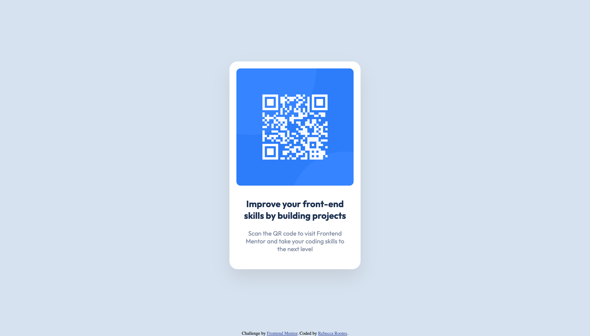

# Frontend Mentor - QR code component solution

This is a solution to the [QR code component challenge on Frontend Mentor](https://www.frontendmentor.io/challenges/qr-code-component-iux_sIO_H). Frontend Mentor challenges help you improve your coding skills by building realistic projects.

## Table of contents

- [Overview](#overview)
  - [Screenshot](#screenshot)
  - [Links](#links)
- [My process](#my-process)
  - [Built with](#built-with)
  - [Continued development](#continued-development)
  - [Useful resources](#useful-resources)
- [Author](#author)
- [Acknowledgments](#acknowledgments)

## Overview

Recreate a centralised card layout containing a QR Code with a title and paragraph text below, following a preset design as accurately as possible. The layout is not mobile responsive and will look the same on mobile and desktop devices.

### Screenshot

### Links

- Solution URL: [My Solution](https://beksterslab.github.io/QR-code-component/)

## My process

I started by creating the grey background for the body element and then adding the div for the white card (.qr-code) which was positioned using flexbox.
I next added the img, h1 and p information and adjusted the css to create a column to change the flow.
The font was changed by linking to GoogleFonts and the relevant weights were selected for h1 and p in the css file.
The subtle box shadow was added at the end, I almost missed it!

### Built with

- Semantic HTML5 markup
- CSS custom properties
- Flexbox

### Continued development

Further revision/work is required on flexbox.

### Useful resources

- [Box Shadows](https://www.xul.fr/en/css/box-shadow.php) - This helped me with the subtle box shadow around the white box, ensuring it works in all browsers.

## Author

- Frontend Mentor - [@BekstersLab](https://www.frontendmentor.io/profile/BekstersLab)
